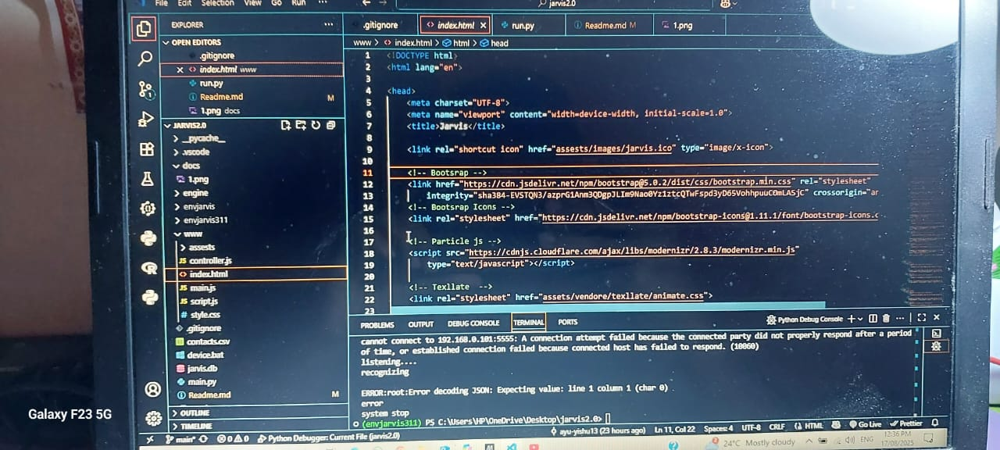
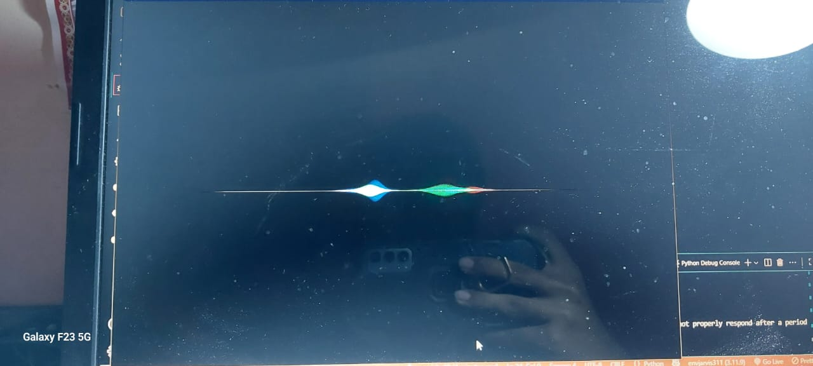
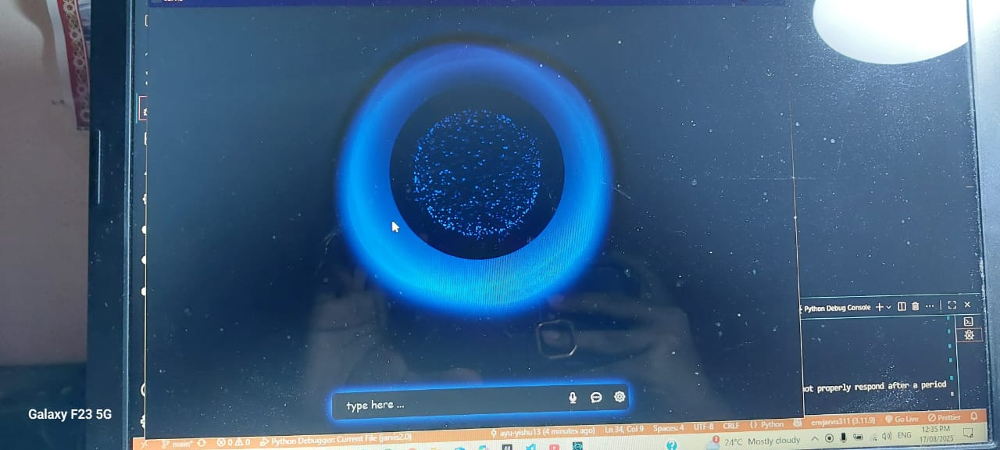
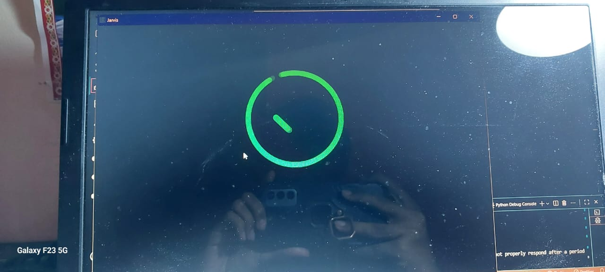

# JARVIS — Your Personal Voice Assistant (Python + Web UI)

> A full working Jarvis built with a Python backend and a modern HTML/CSS/JS frontend. The UI can be hosted on Vercel while the brain runs locally. Clean architecture, easy to extend, and beginner‑friendly to advanced.
> **Author:** Ayush Kumar Rai (aka *Future Lelouch*)

(docs/1.png)

<p align="center">
  <a href="https://www.python.org/"></a>
  <a href="https://developer.mozilla.org/docs/Web/HTML"></a>
  <a href="https://developer.mozilla.org/docs/Web/CSS"></a>
  <a href="https://developer.mozilla.org/docs/Web/JavaScript"></a>
  <a href="https://getbootstrap.com/"></a>
  <a href="https://vercel.com/"></a>
  <a href="https://www.sqlite.org/"></a>
  <a href="https://github.com/ChrisKnott/Eel"></a>
</p>

<p align="center">
  <a href="https://jarvis-ashen-ten.vercel.app/">🔗 Live UI (Vercel)</a> ·
  <a href="#features">Features</a> ·
  <a href="#quick-start">Quick Start</a> ·
  <a href="#project-structure">Structure</a> ·
  <a href="#configuration">Config</a> ·
  <a href="#troubleshooting">Troubleshooting</a>
</p>

---

## Table of Contents

* [About](#about)
* [Features](#features)
* [Technology Stack](#technology-stack)
* [Screenshots / Demo](#screenshots--demo)
* [Quick Start](#quick-start)
* [Project Structure](#project-structure)
* [Configuration](#configuration)
* [Usage](#usage)
* [Extending Jarvis](#extending-jarvis)
* [Troubleshooting](#troubleshooting)
* [Deployment](#deployment)
* [Roadmap](#roadmap)
* [Contributing](#contributing)
* [License](#license)
* [Acknowledgements](#acknowledgements)

---

## About

**Jarvis** is a voice‑driven personal assistant. The Python engine handles speech, intent routing and system actions; the web frontend provides a slick control panel and visual feedback. It’s designed to be:

* **Modular** — add new commands without touching the core.
* **Hackable** — swap STT/TTS or plug in APIs you like.
* **Deployable** — run locally; ship the UI to Vercel for quick sharing.

> Tip: This repository includes a sample SQLite database and CSV contacts so you can get productive immediately.

---

## Features

Use the checklist to reflect your current build. Uncheck items you haven’t enabled yet.

* [x] **Voice activation** (press‑to‑talk or hotkey)
* [x] **Text‑to‑speech** responses
* [x] **Command routing** via Python engine
* [x] **Local database** (SQLite) to store shortcuts/commands
* [x] **Modern UI** (HTML/CSS/JS + Bootstrap)
* [x] **Wake word** (e.g., “Jarvis”)
* [x] **System controls:** open apps, files, websites, volume/brightness
* [x] **Search & knowledge:** Wikipedia/Google/YouTube helpers
* [x] **Productivity:** notes, reminders, to‑do
* [x] **Media:** play/pause, next/prev, local music folder
* [x] **Weather/News** (requires API keys)
* [x] **Smartphone link** (ADB/Wi‑Fi; optional) — call, message, clipboard
* [x] **Computer vision** add‑ons (screenshots, OCR, object detection)

> Feel free to add/remove blocks depending on your actual feature set.

---

## Technology Stack


**Core**

* Python 3.x (engine)
* HTML5, CSS3, JavaScript (frontend)
* Bootstrap 5 (UI components)
* SQLite (persistence)
* Eel (Python ↔ Web bridge for a desktop window)

**Typical Python libraries** (confirm in `requirements.txt` and adjust)

* `SpeechRecognition`, `PyAudio` — speech‑to‑text
* `pyttsx3` — text‑to‑speech
* `requests` — API calls
* `wikipedia`, `pywhatkit`, `psutil`, etc. — helpers (optional)

**Optional integrations**

* Weather/News APIs
* OpenAI/LLM APIs
* Android Debug Bridge (ADB) for device actions

---

## Screenshots / Demo


|  |  |  |  | 
| [UI 6](docs/6.jpg)
**Live UI :** `https://jarvis-ashen-ten.vercel.app/`

---

## Quick Start

### 1) Clone & set up Python

```bash
# clone
git clone https://github.com/ayu-yishu13/Jarvis.git
cd Jarvis

# create venv
# Windows
python -m venv .venv
.\.venv\Scripts\activate
# macOS/Linux
# python3 -m venv .venv && source .venv/bin/activate

# install deps
pip install -r requirements.txt
```

### 2) Run the app

```bash
# common entrypoints — use whichever your project uses
python run.py     # launches the desktop UI bridge
# or
python main.py    # starts the Jarvis core/CLI
```

> On first run, your OS may ask to allow microphone access.

### 3) (Optional) Seed data

* `jarvis.db` — ships with sample data you can modify.
* `contacts.csv` — sample contacts for quick demos. Import into your DB or read directly.

---

## Project Structure

```
Jarvis/
├─ engine/             # Python backend modules (intents, actions, utils)
├─ www/                # Frontend (HTML/CSS/JS, Bootstrap)
├─ main.py             # Entrypoint for the Jarvis core
├─ run.py              # Launches desktop window / web bridge
├─ requirements.txt    # Python dependencies
├─ jarvis.db           # SQLite database (sample)
├─ contacts.csv        # Sample contacts
├─ device.bat          # Helper script for Android (ADB)
├─ .vscode/            # Editor settings
└─ .gitignore
```

> Explore `engine/` to learn how commands are mapped to actions, and `www/` for the UI.

---

## Configuration

Create a `.env` in the project root (optional but recommended):

```ini
# Audio
STT_ENGINE=speechrecognition     # or vosk, etc.
TTS_ENGINE=pyttsx3
MIC_DEVICE_INDEX=default

# API keys (use only the ones you actually integrate)
OPENAI_API_KEY=
WEATHER_API_KEY=
NEWS_API_KEY=

# System / Device
WAKE_WORD=jarvis
ADB_DEVICE_IP=192.168.0.101      # if you use ADB over Wi‑Fi
```

> Then load these in Python (e.g., `python-dotenv`) or your own config loader.

---

## Usage

**Hotkey / PTT:** press the configured key or button in the UI to start listening.

**Sample commands** (adapt to what you’ve implemented):

* “Open Chrome” / “Open VS Code”
* “Search YouTube for lo‑fi beats”
* “What’s the weather in Bangalore today?”
* “Remind me to study at 7 PM”
* “Send WhatsApp to Ayush: I’ll be late”
* “Increase volume to 70%”

> Add your own commands by registering a handler in the engine and (optionally) a UI tile.

---

## Extending Jarvis

### Add a new voice command

1. **Intent:** Create a function in `engine/` (e.g., `engine/commands/media.py`).
2. **Router:** Register it in your command router (e.g., a dict or rule list).
3. **UI (optional):** Add a button/tile in `www/` that calls the same action.
4. **Persist (optional):** Add a row to `jarvis.db` for quick access.

```python
# example router snippet (pseudo)
ROUTES = {
  "open chrome": actions.open_chrome,
  "play music": actions.play_music,
}
```

### Replace STT/TTS engine

* Swap the adapter class (e.g., `engine/stt.py`, `engine/tts.py`).
* Update `.env` to point to the new engine.

### Add an API integration

* Create `engine/integrations/<service>.py`.
* Read keys from environment.
* Expose an action and register it.

---

## Troubleshooting

### Microphone not detected

* Check OS privacy settings.
* On Windows, set the correct input device under Sound Settings.

### PyAudio installation fails (Windows)

* Install **VS Build Tools** (C++) and try again.
* Or use a prebuilt wheel matching your Python version.

### ADB says *unauthorized* / device not found

```bash
adb kill-server
adb start-server
adb devices         # authorize on phone (enable USB debugging)
adb tcpip 5555
adb connect <PHONE_IP>
```

* Ensure Android SDK `platform-tools` are on your PATH.

### Vercel shows 404 for routes (single‑page UI)

Add `vercel.json` with a rewrite to `index.html`:

```json
{
  "rewrites": [{ "source": "/(.*)", "destination": "/index.html" }]
}
```

---

## Deployment

### Host the UI on Vercel

1. Put the static frontend in `www/` (or your chosen folder).
2. In Vercel, set **Framework Preset: “Other”**.
3. **Output Directory:** `www`.
4. (Optional) Add the `vercel.json` above for SPA routing.

### Package as a desktop app

* Use `pyinstaller` or `nuitka` to bundle Python + web assets.
* Example (adjust paths):

```bash
pyinstaller --noconsole --onefile --add-data "www;www" run.py
```

---

## Roadmap

* [ ] Wake‑word engine (Porcupine/Vosk)
* [ ] Settings page (hotkeys, voice, theme)
* [ ] Plugin system for commands
* [ ] Cross‑platform packaging
* [ ] Test suite + CI

---

## Contributing

Contributions are welcome!

1. Fork the repo & create a feature branch.
2. Follow the project structure and keep functions small and testable.
3. Open a Pull Request with a clear description and screenshots if UI changes.

> Run `ruff`/`flake8` (or your linter) and `black` before committing, if configured.

---

## License

Choose a license (MIT recommended for simplicity). Add a `LICENSE` file in the root.
Until then, all rights reserved by the author.

---

## Acknowledgements

* Inspiration from community voice assistants and desktop automation tools.
* Thanks to libraries and services used in this project.

---

### Badges & Tags

`#jarvis` `#python` `#voice-assistant` `#eel` `#bootstrap` `#sqlite` `#web-ui` `#vercel`

---

> **How to customize this README**
>
> * Replace all images under `docs/` with your own screenshots.
> * Mark feature checkboxes that you’ve completed.
> * Update the tech stack to match `requirements.txt`.
> * Add links to demo videos or blog posts.
